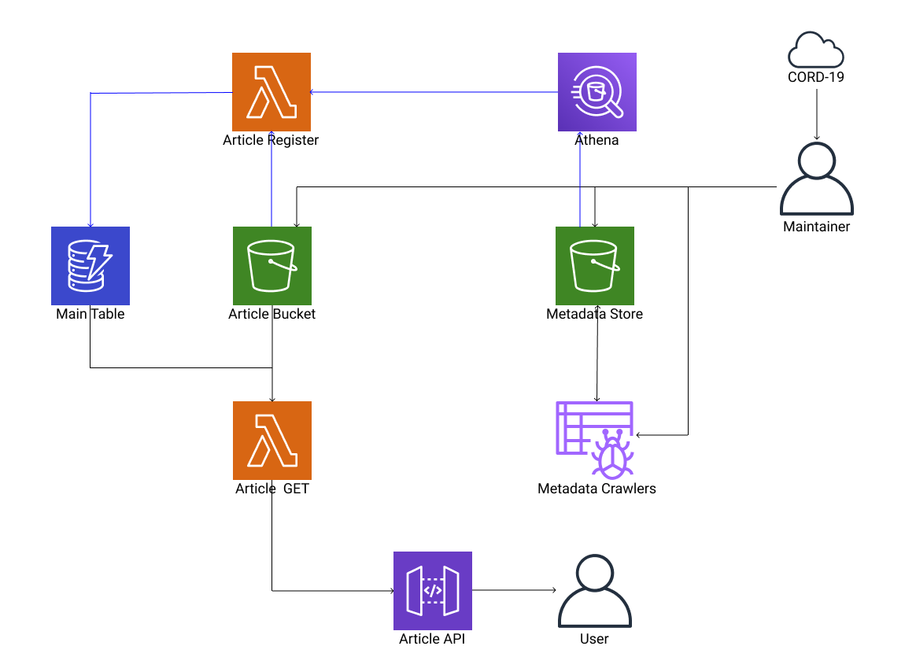

# Database

## Scenarios

### Registering metadata table

1. A `maintainer` downloads a `metadata.csv` from [`CORD-19 database`](https://ai2-semanticscholar-cord-19.s3-us-west-2.amazonaws.com/2020-03-27/metadata.csv).
2. The `maintainer` pushes the `metadata.csv` into the `metadata store`.
3. The `maintainer` triggers a `metadata registration workflow`.
4. The `metadata registration workflow` triggers a `metadata.csv crawler`.
5. The `metadata.csv crawler` interrogates the pushed `metadata.csv`.
6. The `metadata.csv crawler` populates a `metadata.csv table`.
7. The `metadata registration workflow` triggers a `meatdata.csv-to-parquet job`.
8. The `metadata.csv-to-parquet job` converts the `metadata.csv table` into `metadata.parquet` files.
    - The first two letters/digits of a paper ID becomes a partition key.
9. The `metadata registration workflow` triggers a `metadata.parquet crawler`.
10. The `metadata.parquet crawler` interrogates the `metadata.parquet` files.
11. The `metadata.parquet crawler` populates a `metadata.parquet table`.
12. Done

### Registering an article

1. [Registering metadata table](#registering-metadata-table) is done.
    - A `metadata.parquet table` is available.
2. A `maintainer` has an `article` to register.
3. The `maintainer` pushes the `article` into the `article bucket`.
4. The `article bucket` triggers a `article register function`.
5. The `article register function` loads the `article` from the `article bucket`.
6. The `article register function` asks the `metadata.parquet table` for the `metadata` of the `article`.
7. The `article register function` puts the `metadata` into the `main table`.
    - The `metadata` is associated with the `paper ID` of the `article` in the `main table`.
8. Done

### Retrieving an article of a paper ID

1. A `user` somehow knows an `paper ID` of interest.
2. The `user` asks the `article API` for the `article` of the `paper ID`.
3. The `article API` asks the `article GET function` for the `article` of the `paper ID`.
4. The `article GET function` loads the `article` associated with the `paper ID` from the `article bucket`.
5. The `article GET function` asks the `main table` for the `metadata` of the `article`.
6. The `article GET function` augments the `article` with the `metadata`.
7. The `article GET function` returns the `augmented artcle` to the `article API`.
8. The `article API` returns the `augmented article` to the `user`.
9. Done

### Finding an article of a given hash

- `Partition` = `article:{hash}`

### Finding an article with a given tag

- `Partition` = `tag:{tag}`
- `Sort` = `{hash}`